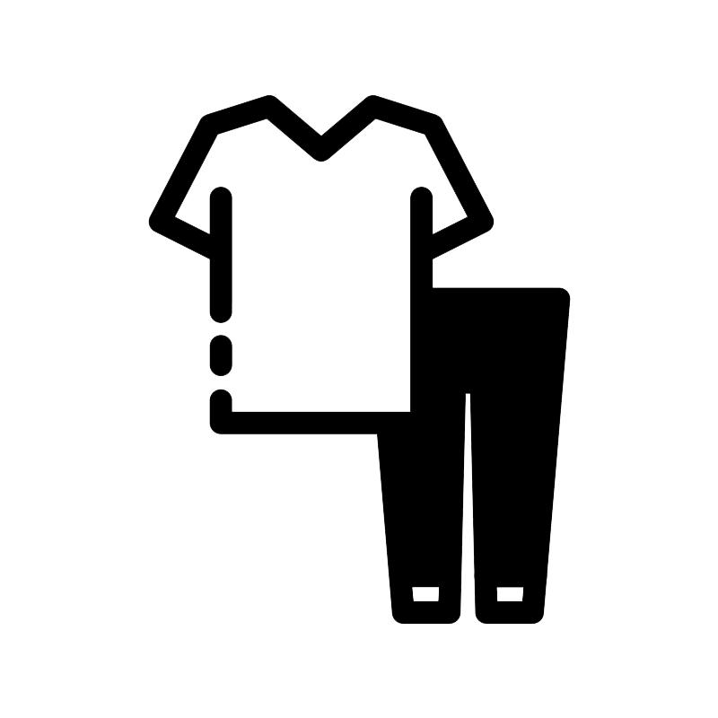

# Warung Anomali

---
##### Nama  : Andi Muhammad Adlyn Fakhreyza Khairi Putra
##### NPM   : 2306241713
##### Kelas : PBP B
##### Link  : http://andi-muhammad37-warunganomali.pbp.cs.ui.ac.id/

# List of Content
---
- #### [Tugas 2](#tugas-2)
- #### [Tugas 3](#tugas-3)
- #### [Tugas 4](#tugas-4)
- #### [Tugas 5](#tugas-5)
- #### [Tugas 6](#tugas-6)

# Tugas 2
___
- ## Step-by-step Implementasi poin-poin yang ada pada Checklist Tugas 2
___

#### Membuat Proyek Django
1. Hal pertama yang perlu dilakukan sebelum membuat proyek Django adalah dengan membuat direktori dengan nama yang diinginkan (dalam project ini nama direktorinya adalah "```warung-anomali```"). Kemudian pergi ke terminal dan pastikan berada didalam direktori ```.\warung-anomali```, dan lakukan inisialisasi repositori git dengan menjalankan: ```git init``` <br> hal ini dilakukan untuk men-*track* perubahan dan *progress* yang ada dalam proyek.
Buat juga *remote repository* di GitHub dan hubungkan dengan repositori di lokal ini.
2. Selanjutnya buat *virtual environment* dengan menjalankan: ```python -m venv env``` <br> dan aktifkan *virtual environment*-nya dengan menjalankan: ```env\Scripts\activate``` <br> *virtual environment* ini dibuat untuk mengisolasi package dan dependencies yang digunakan pada proyek agar tidak mengganggu proyek lain, pun sebaliknya.
3. Langkah selanjutnya adalah menyiapkan *dependencies* dengan cara membuat file baru dengan nama ```requirements.txt``` pada direktori dan menuliskan *dependenciesnya* di file txt tersebut kemudian menjalankan: ```pip install -r requirements.txt ``` <br> untuk melakukan instalasi *dependencies* yang sudah dituliskan dalam ```requirements.txt```.
4. Setelah *dependencies* sudah terinstal, proyek Django dengan nama ```warung_anomali``` bisa dibuat dengan menjalankan: ```django-admin startproject warung_anomali .``` <br> <br> Untuk keperluan *deployment* di local tambahkan juga string ```"localhost"``` dan ```"127.0.0.1"``` pada list ```ALLOWED_HOSTS``` yang bisa ditemukan di ```settings.py``` di dalam direktori ```warung_anomali```. <br> <br> Tambahkan juga berkas ```.gitginore``` untuk memberitahu file/direktori yang tidak perlu di-*track* oleh ```git```. Sebelum melakukan *add* file apapun, *add*, *commit*, *push* terlebih dahulu berkas `.gitignore`.

#### Membuat Aplikasi ```main```
1. Untuk membuat aplikasi ```main```, pergi ke terminal dan jalankan perintah: ```python manage.py startapp main``` <br> sebelum menjalankannya pastikan berada pada direktori utama yaitu ```warung-anomali```. Setelah perintah dijalankan akan muncul direktori baru dengan nama ```main```.
2. Setelah itu, agar Django mengenali  aplikasi ```main``` sebagai bagian dari proyek,  daftarkan aplikasi ```main``` ke dalam proyek dengan menambahkan string ```'main'``` ke dalam list ```INSTALLED_APPS``` pada ```settings.py``` yang berada di dalam direktori ```warung_anomali```.

#### Melakukan *routing* agar dapat menjalankan aplikasi main
1. Buka `urls.py` pada proyek `warung_anomali` kemudian tambahkan `path('', include('main.urls'))` pada list `urlpatterns` seperti berikut:
    ```py
    from django.contrib import admin
    from django.urls import path
    from django.urls import path, include

    urlpatterns = [
        path('admin/', admin.site.urls),
        path('', include('main.urls')), 
    ]
    ```
    Bagian `path('', include('main.urls'))` menghubungkan root URL (yaitu, URL tanpa tambahan apapun seperti `admin/`) dengan file `urls.py` di dalam aplikasi main. Path URL dibiarkan string dibiarkan kosong agar halaman aplikasi main dapat diakses secara langsung. Sedangkan `include('main.urls')` mengarahkan Django untuk memproses URL berdasarkan pola yang didefinisikan di dalam file `urls.py` milik aplikasi main.

#### Membuat model
1. Untuk membuat model pada aplikasi ```main```, saya menuliskan kode berikut ke dalam ```models.py```:
    ```py
    from django.db import models

    class Product(models.Model): # model dengan nama Product
        name = models.CharField(max_length=255) # attribute nama
        price = models.IntegerField() # attribute harga
        description = models.TextField() # attribute deskripsi
    ```
2. Karena melakukan perubahan terhadap model sebelumya, saya perlu melakukan migrasi model dengan menjalankan: ```python manage.py makemigrations``` <br> untuk membuat migrasi model, kemudian melakukan migrasi dengan menjalankan: ```python manage.py migrate```

#### Membuat fungsi pada ```views.py``` untuk dikembalikan ke dalam template ```html```
1. Sebelum membuat fungsi pada ```views.py```, terlebih dahulu saya membuat direktori ```templates``` di dalam ```main```. Kemudian membuat file ```main.html``` di dalam ```templates``` dengan implementasi sebagai berikut:
    ```html
    <h1>{{project_name}}</h1>

    <h5>NPM: </h5>
    <p>{{npm}}</p>
    <h5>Name: </h5>
    <p>{{name}}</p> 
    <h5>Class: </h5>
    <p>{{class}}</p> 
    ```
    Template ini akan menggunakan data dari konteks yang dikirimkan oleh fungsi di ```views.py```.
1. Kemudian dibuat fungsi ```show_main``` pada ```views.py``` yang bertugas untuk menghasilkan respons yang menyajikan halaman HTML sesuai data yang diberikan. Fungsi ini menggunakan template ```main.html``` dan mengirimkan konteks nama proyek, NPM, nama lengkap, dan kelas.
    ```py
    from django.shortcuts import render

    # Create your views here.
    def show_main(request):
        context = {
            'project_name' : 'Warung Anomali',
            'npm' : '2306241713',
            'name': 'Andi Muhammad Adlyn Fakhreyza Khairi Putra',
            'class': 'PBP B'
        }

        return render(request, "main.html", context)
    ```

####  Membuat *routing* pada ````urls.py```` aplikasi ```main``` untuk memetakan fungsi yang telah dibuat pada ```views.py```
1. Selanjutnya, untuk membuat *routing* pada ```urls.py``` yang berada dalam aplikasi ```main``` (buat terlebih dahulu `urls.py` dahulu jika belum),  tambahkan ```path('', show_main, name='show_main')``` pada list ```urlpatterns```, seperti pada kode berikut:
    ```py
    from django.urls import path
    from main.views import show_main

    app_name = 'main'

    urlpatterns = [
        path('', show_main, name='show_main'),
    ]
    ```
    Dengan menambahkan ini, tampilan yang dihasilkan fungsi `show_main` akan ditampilkan ketika aplikasi `main` diakses.


#### Melakukan *Deployment*
1. Untuk melakukan *deployment* ke PWS, *Login* terlebih dahulu ke PWS, dan *Create New Project*.
3. Setelah itu jalankan *Project Commands*, kemudian ubah kembali nama *branch* menjadi main dengan menjalankan: `git branch -M main`
4. Apabila status *deployment* pada proyek di PWS sudah *Running*, artinya sudah berhasil di *deploy*.

#### Membuat `README.md` serta menjawab pertanyaan
`README.md` dan jawaban ini ditulis sesuai dnegan perintah Tugas dan dengan mereka-ulang tahapan-tahapan yang sudah saya lakukan ketika membuat proyek Django , sambil membaca materi yang relevan dalam penyusunan `README.md` ini.


- ## Bagan *request client* ke web aplikasi serta kaitan antara ```urls.py```, ```views.py```, ```models.py```, dan berkas ```html```.
---


- ## Fungsi ```git``` dalam pengembangan perangkat lunak
---
Dalam pengembangan perangkat lunak, `git` memainkan peran penting sebagai *version control system* yang membantu *developer* mengelola perubahan kode secara efektif dan efisien. Setiap perubahan yang dilakukan dalam proyek dapat disimpan sebagai commit, yang memungkinkan kita untuk kembali ke versi sebelumnya jika terjadi kesalahan. Ini memberikan rasa aman saat mengembangkan fitur baru atau memodifikasi yang sudah ada, karena kita tahu bahwa kita selalu bisa kembali ke titik sebelumnya tanpa harus khawatir kehilangan pekerjaan yang sudah dilakukan.

`git` juga memiliki riwayat perubahan yang sangat detil. Setiap perubahan yang dilakukan dicatat sebagai commit dengan pesan yang menggambarkan perubahan tersebut. Hal ini memudahkan pengembang untuk melacak apa yang telah diubah, siapa yang melakukan perubahan, dan kapan perubahan tersebut dilakukan. Ini sangat membantu saat perlu melakukan debugging jika terdapat masalah.

Sebagai sistem terdistribusi, `git` memungkinkan setiap kolaborator memiliki salinan lengkap suatu proyek di komputer mereka masing-masing. Sehingga jika terjadi kerusakan perangkat / data pada satu sumber, masih ada backup data dari kolaborator lainnya. Hal ini meningkatkan keamanan dan integritas data, membuat proses pengembangan terasa lebih aman dan nyaman.

Selain itu `git` juga memfasilitasi kolaborasi dan membantu manajemen proyek ketika bekerja dalam tim. Dengan adanya *branching*, anggota tim bisa dengan mudah membuat *branch* baru untuk mengerjakan fitur spesifik, sementara *branch* utama tetap stabil. Setelah fitur selesai, *branch* dapat digabungkan ke *branch* utama. Ini memungkinkan anggota tim dapat bekerja dan mengerjakan bagiannya masing-masing tanpa harus mengkhawatirkan mengganggu satu sama lain. Ini memungkinkan pengembangan yang lebih terstruktur, serta meminimalisir terjadinya kekacauan dalam kode.


- ## Mengapa *Framework* Django dijadikan permulaan pembelajaran pengembangan perangkat lunak?
---
Menurut saya, Berikut ini alasan mengapa Django cocok dijadikan permulaan pembelajaran pengembangan perangkat lunak:
1. Kemudahan, Django memudahkan pengembangan aplikasi web dengan menyediakan berbagai fitur bawaan. contohnya adalah Django admin. Kemudahan ini membantu pemula untuk lebih fokus pada logika aplikasi tanpa harus menangani aspek-aspek yang kompleks.
2. Kepopuleran dan Komunitas, Django sangat populer dan sangat banyak digunakan. Kepopuleran ini menandakan tersedianya sumber-sumber belajar seperti tutorial dan panduan yang berlimpah. Selain itu juga komunitas yang besar dan aktif dapat menjadi lingkungan yang baik bagi pemula untuk belajar, diskusi, dan berbagi pengalaman.
3. Struktur MVT, Dengan menggunakan arsitektur Model-View-Template, yang memisahkan komponen untuk data, logika aplikasi, dan tampilan, membuat struktur aplikasi terlihat lebih rapi dan mudah dipahami untuk pemula. Pembagian komponen ini memudahkan saya pribadi untuk memahami bagaimana data, logika, dan tampilan saling berinteraksi.
4. Dokumentasi, Django juga menyediakan dokumentasi yang lengkap dan mudah dipahami. Panduan dan tutorial yang jelas tentu saja adalah sumber daya yang berharga bagi pemula.

- ## Mengapa model pada Django disebut sebagai ORM?
---
Karena pada Django, *Model* adalah representasi dari tabel basis data, Setiap model adalah subclass dari `django.db.models.Model`, dan setiap atribut dari model tersebut akan menjadi kolom dalam tabel database. Django juga menyediakan API *query* yangs mengakomodasi *methods* seperti `.filter()`, `.exclude()`, dan `.aggregate()` untuk membangun *query* kompleks tanpa menulis SQL secara langsung. Django mengubah *query* ini menjadi SQL yang sesuai dan menerapkannya pada basis data. Fitur-fitur ini memungkinkan *developer* dapat berinteraksi dengan basis data melalui *code* saja tanpa harus menulis *query* SQL secara manual, spesifiknya melalui *Object Model*. Oleh karena itu, model pada Django disebut *Object-Relational-Mapping* (ORM).

# Tugas 3
---
- ## Mengapa *Data delivery* diperlukan dalam pengimplementasian sebuah platform?
---
Dalam pengembangan suatu platform, sering kali kita ingin mengirimkan data dari satu *stack* ke *stack* lainnya, menerima data dari *user*, dan menyajikan data untuk *user*. Pengiriman data yang efektif, efisien, dan *secure* sangat diperlukan untuk memastikan data dikirimkan dengan tepat/benar, cepat, dan aman.

*Data delivery* memiliki peran signifikan dalam pengiriman data dari satu *stack* ke *stack* lainnya. Ketika data dipindahkan antar *stack*, *Data delivery* yang efektif memastikan informasi dikirimkan dengan akurat dan cepat, yang sangat penting untuk integrasi dan interoperabilitas antar komponen platform. Dengan sistem yang optimal, proses pengiriman data dapat dilakukan dengan lancar sehingga menjaga alur kerja dan mengurangi kemungkinan kesalahan atau kehilangan data.

*Data delivery* yang baik juga sangat diperlukan dalam mendukung interaksi antar *user* dan platform. *Data delivery* memastikan *user* dapat mengakses informasi yang tersedia saat dibutuhkan. Pengiriman data yang efektif dan efisien juga memungkinkan *user* untuk berkomunikasi dengan platform tanpa gangguan, memberikan respons yang cepat dan akurat. 

- ## Menurutmu, mana yang lebih baik antara XML dan JSON? Mengapa JSON lebih populer dibandingkan XML?
---
XML dan JSON memiliki kelebihan dan kekurangannya masing-masing, namun menurut saya JSON lebih unggul, setidaknya untuk alasan-alasan berikut, yang juga menjelaskan mengapa JSON lebih populer:
* JSON lebih ringkas, sederhana, dan mudah dipahami dibandingkan XML. Format JSON menggunakan struktur pasangan kunci-nilai yang jelas, membuat data lebih mudah dibaca dan ditulis oleh manusia serta lebih mudah diproses oleh mesin.
* Karena JSON lebih ringkas, ukuran data yang dikirim dan diterima biasanya lebih kecil dibandingkan dengan XML. Ini dapat mengurangi waktu pemrosesan.
* JSON lebih cepat diparse oleh browser dan aplikasi karena strukturnya yang sederhana dan sudah dioptimalkan. Parsing JSON biasanya memerlukan lebih sedikit waktu dibandingkan XML
* Integrasi dengan JavaScript, JSON secara bawaan didukung oleh JavaScript, menjadikannya format utama untuk aplikasi web dan API yang berbasis JavaScript. JSON dapat dengan mudah diintegrasikan dan diproses langsung oleh JavaScript.

- ## Fungsi dari method `is_valid()` pada form Django dan alasan method tersbut dibutuhkan
---
Fungsi method `is_valid()` adalah untuk memeriksa apakah data yang dimasukkan dalam form memenuhi semua aturan validasi yang telah ditentukan dalam form yang bersangkutan. Meliputi: pengecekan bahwa semua field yang diperlukan telah diisi, data yang dimasukkan sesuai dengan tipe yang diharapkan, dan apakah data memenuhi batasan atau kriteria yang telah ditetapkan.

Alasan mengapa method ini diperlukan antara lain:
    1. Memastikan data yang diisikan oleh *user* sesuai dengan format dan aturan yang telah ditetapkan.
    2. Mencegah data yang salah atau tidak sesuai dari masuk ke dalam sistem
    3. Meningkatkan keamanan aplikasi dengan memastikan bahwa data yang dimasukkan tidak mengandung nilai-nilai yang dapat membahayakan aplikasi atau database, seperti input berbahaya yang dapat menyebabkan serangan *SQL injection* atau *XSS*.

- ## Mengapa `csrf_token` dibutuhkan saat membuat form di Django? Apa yang dapat terjadi jika tidak menambahkan `csrf_token` pada form Django? Bagaimana hal tersebut dapat dimanfaatkan oleh penyerang?
---
#### Mengapa csrf_token Diperlukan Saat Membuat Form di Django? 
Karena `csrf_token` berfungsi untuk memverifikasi *request* yang dikirim ke server berasal dari form yang valid dan bukan dari sumber luar. Dengan memastikan bahwa permintaan hanya diproses jika token yang disertakan sesuai dengan yang ada di server, data *user* dan operasi penting dapat terlindungi dari campur tangan oknum yang tidak sah.

#### Apa yang Terjadi Jika Tidak Menambahkan csrf_token pada Form di Django dan bagaimana Hal Tersebut Dapat Dimanfaatkan oleh Penyerang?? 
Aplikasi menjadi rentan terhadap serangan CSRF. Penyerang dapat membuat form berbahaya di web yang mereka buat dan mengirimkan *request* berbahaya menggunakan kredensial *user* yang sudah *login*. Dengan begitu penyerang dapat melakukan tindakan yang merugikan seperti mulai dari mengakses data secara tidak sah, perubahan data, serta transaksi tidak sah.

- ## Step-by-step Implementasi poin-poin yang ada pada Checklist Tugas 3
---
#### Membuat input form untuk menambahkan objek model pada app sebelumnya
1. sebelum membuat form, saya mengimplementasikan *Skeleton* terlebih dahulu sebagai kerangka *Views*. Dengan cara membuat subdirektori baru dengan nama `template` di root dan menambahkan berkas `base.html` dengan isi sebagai berikut:
```html

<!DOCTYPE html>
<html lang="en">
  <head>
    <meta charset="UTF-8" />
    <meta name="viewport" content="width=device-width, initial-scale=1.0" />
     
  </head>

  <body>
     
  </body>
</html>
```
2. Kemudian menambahkan baris berikut pada `settings.py agar `base.html` terdeteksi sebagai berkas template:
```py
...
TEMPLATES = [
    {
        'BACKEND': 'django.template.backends.django.DjangoTemplates',
        'DIRS': [BASE_DIR / 'templates'], # Tambahkan konten baris ini
        'APP_DIRS': True,
        ...
    }
]
...
```
3. Selanjutnya saya mengubah sedikit `models.py` dan mengubah primary key dari integer menjadi UUID. Setelah melakukan perubahan saya melakukan migrasi model
```py
from django.db import models
import uuid
class Product(models.Model):

    id = models.UUIDField(primary_key=True, default=uuid.uuid4, editable=False)
    name = models.CharField(max_length=255)
    price = models.IntegerField()
    description = models.TextField()
    color = models.CharField(max_length=50)
    stock = models.IntegerField()
```

4. Membuat berkas baru `forms.py` untuk pada direktori `main` seperti berikut:
```py
from django.forms import ModelForm
from main.models import Product

class ProductForm(ModelForm):
    class Meta:
        model = Product
        fields = ["name", "price", "description", "color", "stock"]
```
5. Menambahkan beberapa import, fungsi `create_product_entry` dan mengubah sedikit fungsi `show_main` pada `views.py` menjadi seperti berikut:
```py
from django.shortcuts import render, redirect
from main.forms import ProductForm
from main.models import Product

# Fungsi yang menampilkan main
def show_main(request):
    product_entries = Product.objects.all()
    
    context = {
        'project_name' : 'Warung Anomali',
        'npm' : '2306241713',
        'name': 'Andi Muhammad Adlyn Fakhreyza Khairi Putra',
        'class': 'PBP B',
        'product_entries': product_entries
    }

    return render(request, "main.html", context)

def create_product_entry(request):
    form = ProductForm(request.POST or None)

    if form.is_valid() and request.method == "POST":
        form.save()
        return redirect('main:show_main')

    context = {'form': form}
    return render(request, "create_product_entry.html", context)
```
6. Kemudian menambahkan `url` berikut pada `urlpatterns` didalam `urls.py` yang berada di direktori `main`:
```py
urlpatterns = [
    path('', show_main, name='show_main'),
    path('create-product-entry', create_product_entry, name='create_product_entry'),
    ...
]
```
7. Saya juga tidak lupa menambahkan file `create_product_entry.html` pada subdirektori templates untuk menampilkan form
```html
 

<h1>Add New Product Entry</h1>

<form method="POST">
  
  <table>
    {{ form.as_table }}
    <tr>
      <td></td>
      <td>
        <input type="submit" value="Add Product Entry" />
      </td>
    </tr>
  </table>
</form>


```
8. Terakhir saya mengubah isi `main.html` menjadi seperti berikut agar menggunakan template `base.html`, menambahkan button untuk pergi ke form, serta menampilkan data product yang telah diisikan pada form
```html


<h1>{{project_name}}</h1>

<h5>NPM: </h5>
<p>{{npm}}</p>
<h5>Name: </h5>
<p>{{name}}</p> 
<h5>Class: </h5>
<p>{{class}}</p> 


<p>Belum ada data product pada warung alomani.</p>

<table>
  <tr>
    <th>Product Name</th>
    <th>Price</th>
    <th>Descriptions</th>
    <th>Color</th>
    <th>Stock</th>    
  </tr>

   Berikut cara memperlihatkan data product di bawah baris ini 
   
  
  <tr>
    <td>{{product_entry.name}}</td>
    <td>{{product_entry.price}}</td>
    <td>{{product_entry.description}}</td>
    <td>{{product_entry.color}}</td>
    <td>{{product_entry.stock}}</td>    
  </tr>
  
</table>


<br />

<a href="">
  <button>Add New Product Entry</button>
</a>


```

Dengan melakukan step - step diatas form sudah dapat digunakan

#### Menambahkan 4 fungsi views baru untuk melihat objek yang sudah ditambahkan dalam format XML, JSON, XML by ID, dan JSON by ID
1. Untuk melihat objek yang sudah ditambahkan, saya menambahkan 4 fungsi berikut ke dalam `views.py` (`show_xml`, `show_json`, `show_xml_by_id`, dan `show_json_by_id`) dan juga mengimport `HttpResponse` dan `serializers`. Sehingga isi `views.py` menjadi seperti berikut:
```py
from django.shortcuts import render, redirect
from main.forms import ProductForm
from main.models import Product
from django.http import HttpResponse
from django.core import serializers

# Fungsi yang menampilkan main
def show_main(request):
    product_entries = Product.objects.all()
    
    context = {
        'project_name' : 'Warung Anomali',
        'npm' : '2306241713',
        'name': 'Andi Muhammad Adlyn Fakhreyza Khairi Putra',
        'class': 'PBP B',
        'product_entries': product_entries
    }

    return render(request, "main.html", context)

def create_product_entry(request):
    form = ProductForm(request.POST or None)

    if form.is_valid() and request.method == "POST":
        form.save()
        return redirect('main:show_main')

    context = {'form': form}
    return render(request, "create_product_entry.html", context)

def show_xml(request):
    data = Product.objects.all()
    return HttpResponse(serializers.serialize("xml", data), content_type="application/xml")

def show_json(request):
    data = Product.objects.all()
    return HttpResponse(serializers.serialize("json", data), content_type="application/json")

def show_xml_by_id(request, id):
    data = Product.objects.filter(pk=id)
    return HttpResponse(serializers.serialize("xml", data), content_type="application/xml")

def show_json_by_id(request, id):
    data = Product.objects.filter(pk=id)
    return HttpResponse(serializers.serialize("json", data), content_type="application/json")
```

#### Membuat routing URL untuk masing-masing views yang telah ditambahkan
1. Terakhir saya melakukan routing dengan menambahkan `url` berikut ke `urlpatterns` pada `urls.py` yang berada di direktori `main`:
```py
from django.urls import path
from main.views import show_main, create_product_entry, show_xml, show_json, show_xml_by_id, show_json_by_id

app_name = 'main'

urlpatterns = [
    path('', show_main, name='show_main'),
    path('create-product-entry', create_product_entry, name='create_product_entry'), # routing untuk form
    path('xml/', show_xml, name='show_xml'), # routing untuk melihat keseluruhan object dalam format xml
    path('json/', show_json, name='show_json'), # routing untuk melihat keseluruhan object dalam format json
    path('xml/<str:id>/', show_xml_by_id, name='show_xml_by_id'), # routing untuk melihat object dengan id tertentu dalam format xml
    path('json/<str:id>/', show_json_by_id, name='show_json_by_id'), # routing untuk melihat object dengan id tertentu dalam format json
]
```

- ## *Screenshot* dari hasil akses URL pada *Postman*
---
**XML**  

  
**JSON**  


**XML by id**  


**JSON by id**  


# Tugas 4
---
- ## Apa perbedaan antara `HttpResponseRedirect()` dan `redirect()`
---

1. Tipe Objek yang Dihasilkan:
   - `HttpResponseRedirect()` mengembalikan objek `HttpResponseRedirect`, yang merupakan subkelas dari `HttpResponse`. Objek ini secara langsung mewakili respons HTTP dengan kode status 302 (Found).
   - `redirect()` mengembalikan objek `HttpResponseRedirect` secara tidak langsung. Ini adalah fungsi yang disediakan Django untuk membuat pengalihan lebih mudah dan lebih terbaca.

2. Kontrol atas Objek Respons:
   - `HttpResponseRedirect()` memiliki kontrol yang lebih langsung atas objek respons yang dihasilkan. Ini memungkinkan kita untuk mengatur atribut-atribut tambahan pada objek respons, seperti header, cookie, dan lain-lain.
   - `redirect()` menyediakan *interface* yang lebih sederhana dan terbaca, namun lebih sedikit kontrol.

3. Sintaks Penggunaan:
   - `HttpResponseRedirect()` memerlukan URL tujuan sebagai argumen konstruktor, misalnya `HttpResponseRedirect('/some/url/')`.
   - `redirect()` dapat menerima berbagai jenis argumen, seperti string URL, nama URL, atau bahkan objek model. Contoh: `redirect('/some/url/')` atau `redirect('view_name')`.

4. Fungsionalitas Tambahan:
   - `redirect()` dapat secara otomatis mengenali URL berdasarkan nama view yang diberikan, sementara `HttpResponseRedirect()` hanya menerima URL sebagai argumen.
   - `redirect()` juga dapat menangani argumen yang merepresentasikan objek model, dan akan secara otomatis menghasilkan URL yang sesuai.

Secara umum, `redirect()` menyediakan *interface* yang lebih mudah digunakan dan terbaca, sementara `HttpResponseRedirect()` memberi Anda kontrol yang lebih langsung atas objek respons yang dihasilkan.

- ## Jelaskan cara kerja penghubungan model `Product` dengan `User`!
---
1. Menambahkan relasi pada model `Product`:
   - Pada model `Product`, kita perlu menambahkan sebuah field yang menjadi foreign key ke model `User`.
   - Biasanya field ini diberi nama `user`, misalnya:
     ```python
     from django.contrib.auth.models import User

     class Product(models.Model):
         user = models.ForeignKey(User, on_delete=models.CASCADE, related_name='products')
         # field lain...
     ```
   - Dengan menambahkan `user` field yang merupakan `ForeignKey` ke model `User`, setiap objek `Product` akan terhubung dengan satu objek `User`.

2. Menetapkan nilai `user` saat membuat `Product`:
   - Ketika membuat instance baru dari `Product`, kita harus menetapkan nilai `user` field dengan menggunakan `request.user` untuk mendapatkan pengguna yang sedang login:
     ```python
     def create_product_entry(request):
         if request.method == 'POST':
             form = ProductForm(request.POST)
             if form.is_valid():
                 product = form.save(commit=False)
                 product.user = request.user
                 product.save()
                 return redirect('show_main')
     ```
   - Dengan menetapkan `user` field dengan `request.user`, setiap `Product` yang dibuat akan terhubung dengan pengguna yang sedang login.

3. Menampilkan produk berdasarkan pengguna:
   - Setelah menghubungkan `Product` dengan `User`, kita dapat dengan mudah menampilkan produk berdasarkan pengguna tertentu.
   - Misalnya, untuk menampilkan semua produk milik pengguna yang sedang login:
     ```python
     def show_main(request):
         product_entries = Product.objects.filter(user=request.user)
         # ...
     ```
   - Dengan filter `user=request.user`, kita akan mendapatkan semua objek `Product` yang dimiliki oleh pengguna yang sedang login saat itu.

Dengan menghubungkan model `Product` dengan `User` melalui foreign key, kita dapat dengan mudah mengidentifikasi pemilik setiap produk dan melakukan operasi-operasi yang melibatkan relasi antara pengguna dan produk, seperti membatasi akses, menampilkan produk milik pengguna tertentu, dan lain-lain.

- ## Apa perbedaan antara *authentication* dan *authorization*, apakah yang dilakukan saat pengguna login? Jelaskan bagaimana Django mengimplementasikan kedua konsep tersebut.
---
1. Authentication (Otentikasi):
    - Authentication adalah proses verifikasi identitas pengguna, biasanya dengan meminta kredensial seperti username dan password.
    - Tujuan dari authentication adalah untuk memastikan bahwa pengguna adalah siapa yang dia klaim.
    - Saat pengguna login, Django melakukan authentication dengan memverifikasi kredensial pengguna (username dan password) menggunakan fungsi `authenticate()`.

2. Authorization (Otorisasi):
    - Authorization adalah proses menentukan apa yang dapat dilakukan oleh pengguna yang telah terautentikasi.
    - Authorization berkaitan dengan hak akses dan perizinan yang dimiliki pengguna.
    - Otorisasi dilakukan dengan menggunakan permissions (izin) dan groups (grup). Setiap model di Django memiliki perizinan bawaan seperti add, change, dan delete.
    - Groups mengelompokkan pengguna ke dalam grup yang memiliki izin tertentu. Hal ini memudahkan pengelolaan hak akses pengguna.
    - Selain itu, Django menyediakan fungsi `has_perm()` untuk memeriksa apakah pengguna memiliki izin tertentu untuk melakukan suatu tindakan.

- ## Bagaimana Django mengingat pengguna yang telah login? Jelaskan kegunaan lain dari cookies dan apakah semua cookies aman digunakan?
---

**Bagaimana Django Mengingat Pengguna yang Telah Login?**
- Django menggunakan cookies untuk menyimpan informasi sesi pengguna yang telah login.
- Setelah pengguna berhasil login, Django akan membuat session ID dan menyimpannya dalam cookie di browser pengguna.
- Setiap kali pengguna membuat permintaan ke aplikasi, Django akan memeriksa cookie untuk menemukan session ID yang valid. Jika ditemukan, Django akan memuat informasi sesi pengguna dan mengotentikasi pengguna.
- Dengan menggunakan cookies, Django dapat mengidentifikasi pengguna yang telah login tanpa perlu meminta kredensial login setiap kali pengguna membuat permintaan.

**Kegunaan Lain dari Cookies**
- Selain untuk menyimpan informasi sesi pengguna, cookies juga memiliki banyak kegunaan lain, seperti:
  1. Menyimpan preferensi pengguna: Cookies dapat digunakan untuk menyimpan preferensi pengguna, seperti tema, bahasa, atau pengaturan lainnya.
  2. Melacak aktivitas pengguna: Cookies dapat digunakan untuk melacak aktivitas pengguna di website, seperti halaman yang dikunjungi atau barang yang ditambahkan ke keranjang.
  3. Menyimpan data sesi: Cookies dapat digunakan untuk menyimpan data sesi untuk aplikasi web, seperti barang dalam keranjang belanja atau riwayat penelusuran.

**Apakah Semua Cookies Aman Digunakan?**
- Tidak semua cookies aman digunakan. Cookies dapat diakses oleh pihak lain jika tidak dikelola dengan baik, sehingga dapat menimbulkan masalah keamanan.
- Beberapa masalah keamanan yang dapat terjadi dengan cookies adalah:
  1. Pencurian informasi: Jika cookies tidak diamankan dengan baik, informasi sensitif yang disimpan dalam cookies dapat dicuri oleh pihak yang tidak berwenang.
  2. Serangan CSRF (Cross-Site Request Forgery): Cookies dapat dimanfaatkan untuk melakukan serangan CSRF, di mana pengguna tanpa sadar melakukan tindakan yang tidak diinginkan.
- Untuk menjaga keamanan, Django mengenkripsi cookies dan memastikan cookies hanya dapat diakses melalui HTTPS. Django juga mengimplementasikan CSRF protection untuk mencegah serangan CSRF.
- Selain itu, pengguna juga harus memastikan untuk logout saat selesai menggunakan aplikasi untuk menghapus sesi dan cookies terkait.

Jadi, meskipun cookies memiliki banyak kegunaan, pengelolaan dan perlindungan cookies yang tepat sangat penting untuk menjaga keamanan aplikasi web.

- ## Step-by-step Implementasi poin-poin yang ada pada Checklist Tugas 4
---
#### Mengimplementasikan fungsi registrasi, login, dan logout
* Membuat fungsi dan form registrasi
    1. Import library yang diperlukan dan membuat fungsi `register` pada `main/views.py` dan import library yang diperlukan
    ```py
    from django.contrib.auth.forms import UserCreationForm
    from django.contrib import messages
    ```
    ```py
    def register(request):
        form = UserCreationForm()

        if request.method == "POST":
            form = UserCreationForm(request.POST)
            if form.is_valid():
                form.save()
                messages.success(request, 'Your account has been successfully created!')
                return redirect('main:login')
        context = {'form':form}
        return render(request, 'register.html', context)
    ```
    2. Membuat `register.html` pada `main/templates` untuk menampilkan halaman registrasi
    ```html
    

    
    <title>Register</title>
    

    

    <div class="login">
    <h1>Register</h1>

    <form method="POST">
        
        <table>
        {{ form.as_table }}
        <tr>
            <td></td>
            <td><input type="submit" name="submit" value="Daftar" /></td>
        </tr>
        </table>
    </form>

    
    <ul>
        
        <li>{{ message }}</li>
        
    </ul>
    
    </div>

    
    ```
    3. Kemudian melakukan routing dengan menambahkan path berikut ke dalam `main/urls.py`
    ```py
    urlpatterns = [
        ...
        path('register/', register, name='register'),
    ]  
    ```
* Membuat fungsi dan halaman login
    1. Import library yang diperlukan kemudian buat fungsi `login_user` pada `main/views.py`
    ```py
    from django.contrib.auth.forms import UserCreationForm, AuthenticationForm
    from django.contrib.auth import authenticate, login
    ```
    ```py
    def login_user(request):
        if request.method == 'POST':
            form = AuthenticationForm(data=request.POST)

            if form.is_valid():
                    user = form.get_user()
                    login(request, user)
                    return redirect('main:show_main')

        else:
            form = AuthenticationForm(request)
        context = {'form': form}
        return render(request, 'login.html', context)
   ```
   2. Membuat `login.html` pada `main/template`sebagai tampilan ketika login
   ```html
   

    
    <title>Login</title>
    

    
    <div class="login">
    <h1>Login</h1>

    <form method="POST" action="">
        
        <table>
        {{ form.as_table }}
        <tr>
            <td></td>
            <td><input class="btn login_btn" type="submit" value="Login" /></td>
        </tr>
        </table>
    </form>

    
    <ul>
        
        <li>{{ message }}</li>
        
    </ul>
     Don't have an account yet?
    <a href="">Register Now</a>
    </div>

    
   ```
   3. Kemudian melakukan routing dengan menambahkan path berikut ke dalam `main/urls.py`
    ```py
    urlpatterns = [
        ...
        path('login/', login_user, name='login'),
    ]
    ```
* Membuat fungsi logout dan menambahkan tombolnya pada `main.html`
    1. Tambahkan fungsi `logout_user` pada `main/views.py` untuk melakukan mekanisme logout
    ```py
    def logout_user(request):
        logout(request)
        return redirect('main:login')
    ```
    2. Menambahkan `logout` button ke `main.html`
    ```py
    ...
    <a href="">
    <button>Logout</button>
    </a>
    ```
    3. Melakukan routing dengaan menambahkan fungsi berikut ke `urlspatterns` berikut
    ```py
    urlpatterns = [
    ...
    path('logout/', logout_user, name='logout'),
    ]
    ```

* Tambahan karena saya ingin merestriksi halaman utama untuk login terlebih dahulu,
import library yag diperulkan dan tambahkan potoongan kode berikut pada fungsi `show_main` yang terdapat pada `views.py`
    ```py
    from django.contrib.auth.decorators import login_required
    ```
    ```py
    ...
    @login_required(login_url='/login')
    def show_main(request):
    ...
    ```
#### Menampilkan detail informasi pengguna yang sedang logged in seperti username dan menerapkan `cookies` seperti `last login` pada halaman utama aplikasi.
Untuk bisa melakukan ini yang perlu dilakukan adalah:
1. Menambahkan import yang diperlukan kemudian menambahkan `cookies` yang bernama `last_login` pada fungsi `login_user` yang terletak di `views.py`
```py
import datetime
from django.http import HttpResponseRedirect
from django.urls import reverse
```
```py
...
if form.is_valid():
    user = form.get_user()
    login(request, user)
    response = HttpResponseRedirect(reverse("main:show_main"))
    response.set_cookie('last_login', str(datetime.datetime.now()))
    return response
...
```

2. Kemudian pada fungsi show_main, tambahkan potongan kode `'last_login'`: `request.COOKIES['last_login']` ke dalam variabel context.
```py
context = {
        'project_name' : 'Warung Anomali',
        'npm' : '2306241713',
        'name': 'Andi Muhammad Adlyn Fakhreyza Khairi Putra',
        'class': 'PBP B',
        'product_entries': product_entries,
        'last_login': request.COOKIES['last_login']
    }
```

3. Karena cookies perlu dihapus ketika user logout, tambahkan juga kode berikut ke dalam fungsi logout
```py
def logout_user(request):
    logout(request)
    response = HttpResponseRedirect(reverse('main:login'))
    response.delete_cookie('last_login')
    return response
```
4. Untuk menampilkannya kita perlu menambahkan ini ke dalam file `main.html`
```html
...
<h5>Sesi terakhir login: {{ last_login }}</h5>
...
```

#### Menghubungkan model `Product` dengan `User`.
1. Tambahkan import yang dibutuhkan dalam `models.py` 
```py
...
from django.contrib.auth.models import User
...
```
2. Tambahkan kode berikut ke dalam model
```py
class Product(models.Model):
    user = models.ForeignKey(User, on_delete=models.CASCADE)
    ...
```

3. Kemudian ubah kode pada fungsi `create_product_entry` pada `views.py` menjadi seperti berikut
```py
def create_product_entry(request):
    form = ProductForm(request.POST or None)

    if form.is_valid() and request.method == "POST":
        form.save()
        return redirect('main:show_main')
    
    if form.is_valid() and request.method == "POST":
        product_entry = form.save(commit=False)
        product_entry.user = request.user
        product_entry.save()
        return redirect('main:show_main')

    context = {'form': form}
    return render(request, "create_product_entry.html", context)
```
4. Kemudian untuk menapilkan username dari user yang sedang login, ubah `conext` pada fungsi `show_main` sebagai berikut
```py
def show_main(request):
    product_entries = Product.objects.filter(user=request.user)

    context = {
         'name': request.user.username,
         ...
    }
...
```
5. Kemudian lakukan migrasi model

#### Membuat dua akun pengguna dengan masing-masing tiga *dummy data* menggunakan model yang telah dibuat


# Tugas 5
---
- ## Jika terdapat beberapa CSS selector untuk suatu elemen HTML, jelaskan urutan prioritas pengambilan CSS selector tersebut!
---
Urutan prioritas dalam CSS disebut adalah sebagai berikut:

1. **Inline Styles**: Style yang diterapkan langsung pada elemen menggunakan atribut `style`. Contoh:
   ```html
   <div style="color: red;">Hello World</div>
   ```

2. **ID Selectors**: Selector yang menggunakan ID, yang ditandai dengan simbol `#`. Contoh:
   ```css
   #header { color: blue; }
   ```

3. **Class, Attribute, dan Pseudo-class Selectors**: Selector ini memiliki tingkat prioritas yang sama. Selector kelas menggunakan titik `.`, attribute selector menggunakan tanda kurung siku `[]`, dan pseudo-class menggunakan tanda titik dua `:`. Contoh:
   ```css
   .menu { color: green; }
   [type="text"] { border: 1px solid black; }
   a:hover { text-decoration: underline; }
   ```

4. **Element Selectors**: Selector untuk elemen HTML. Contoh:
   ```css
   p { font-size: 16px; }
   ```

5. **Universal Selector**: Selector yang memilih semua elemen dengan menggunakan tanda bintang `*`. Contoh:
   ```css
   * { margin: 0; padding: 0; }
   ```

**Note:** Jika terdapat dua atau lebih selector memiliki prioritas yang sama, aturan yang ditulis terakhir dalam CSS akan diambil.

- ## Mengapa responsive design menjadi konsep yang penting dalam pengembangan aplikasi web? Berikan contoh aplikasi yang sudah dan belum menerapkan responsive design!
---
Karena Responsive design sangat berpengaruh kepada pengalaman pengguna. Dengan menerapkan responsive design sebuah aplikasi bisa di akses pada perangkat - perangkat dengan ukuran layar yang berbeda, tidak hanya pada satu perangkat dengan ukuran tertentu saja. Jika tidak menerapkan responsive mungkin akan mempersulit penggunaan aplikasi karena tampilan yang kacau atau bahkan ada fitur yang tidak bisa digunakan karena keterbatasan tampilan pada suatu ukuran saja.

- **Contoh aplikasi yang sudah menerapkan responsive design**, aplikasi - aplikasi besar seperti *amazon*, *Scele*, *Dicoding*, dan masih banyak lagi

- **Contoh aplikasi yang belum menerapkan responsive design**, SIAK-NG

- ## Jelaskan perbedaan antara margin, border, dan padding, serta cara untuk mengimplementasikan ketiga hal tersebut!
---
- **Margin**: adalah ruang di luar elemen. Margin mengatura jarak antara elemen dengan yang lain.
  - Implementasi:
    ```css
    .container {
        margin: 20px; /* ruang di luar elemen */
    }
    ```

- **Border**: Garis yang mengelilingi elemen. Dapat diatur ketebalan, jenis, dan warnanya.
  - Implementasi:
    ```css
    .box {
        border: 2px solid black; /* Garis di sekeliling elemen */
    }
    ```

- **Padding**: Ruang di dalam elemen, mengatur jarak antara konten dan border. Menambah ruang di dalam elemen.
  - Implementasi:
    ```css
    .content {
        padding: 10px; /* Ruang di dalam elemen */
    }
    ```

- ## Jelaskan konsep flex box dan grid layout beserta kegunaannya!
---
- **Flexbox**
Flexbox merupakan sistem tata letak satu dimensi yang digunakan untuk membuat layout yang fleksibel. Elemen-elemen di dalam kontainer dapat secara otomatis menyesuaikan ukuran berdasarkan ruang yang tersedia, baik dalam baris atau kolom. Flexbox memudahkan pengaturan penempatan elemen, perataan, dan pengaturan ruang di antara elemen-elemen.
Kegunaan: Flexbox sangat cocok untuk mengelola tata letak responsif pada komponen kecil, seperti menu navigasi atau daftar item. Dengan kemampuan untuk mengatur ukuran dan ruang secara fleksibel, Flexbox memungkinkan desain yang lebih dinamis dan responsif.

- **Grid Layout**
Grid Layout merupakan sistem tata letak dua dimensi yang digunakan untuk membuat layout dalam bentuk baris dan kolom. Dengan Grid, kita bisa menentukan berapa banyak kolom dan baris yang ada dalam layout serta bagaimana elemen ditempatkan di dalam grid tersebut. Grid memberikan kontrol yang lebih besar atas penempatan elemen dan sangat efektif untuk tata letak yang kompleks.
Kegunaan: Grid Layout ideal untuk halaman web dengan banyak bagian terpisah, di mana penempatan elemen perlu diatur dengan lebih detail. Ini memungkinkan pembuatan desain yang lebih terstruktur dan rapi.

- ## Jelaskan bagaimana cara kamu mengimplementasikan checklist di atas secara step-by-step (bukan hanya sekadar mengikuti tutorial)!
---

### Setup Tailwind dan konfigurasi static files untuk styling
1. Sambungkan tempalate django dengan tailwind
dengan mengubah `base.html` menjadi seperti berikut
    ```html
    
    <!DOCTYPE html>
    <html lang="en">
    <head>
        <meta charset="UTF-8" />
        <meta name="viewport" content="width=device-width, initial-scale=1.0" />
         
        <script src="https://cdn.tailwindcss.com"></script>
        <link rel="stylesheet" href=""/>
    </head>
    <body class="bg-black">
         
    </body>
    </html>
    ```
2. Konfigurasi static files,
    - pada `settings.py` tambahkan
        ```html
            ...
            MIDDLEWARE = [
                'django.middleware.security.SecurityMiddleware',
                'whitenoise.middleware.WhiteNoiseMiddleware', #Tambahkan tepat di bawah SecurityMiddleware
                ...
            ]
            ...
        ```
        dan juga
        ```html
            ...
            STATIC_URL = '/static/'
            if DEBUG:
                STATICFILES_DIRS = [
                    BASE_DIR / 'static' # merujuk ke /static root project pada mode development
                ]
            else:
                STATIC_ROOT = BASE_DIR / 'static' # merujuk ke /static root project pada mode production
            ...
        ```
3. Menambahkan static direktori `static` pada root dan pada direktori tersebut tambahkan folder `css` dan `image`. Pada `css` saya menambahkan file `global.css` berikut
    ```html
        .form-style form input, form textarea, form select {
        width: 100%;
        padding: 0.5rem;
        border: 2px solid #bcbcbc;
        border-radius: 0.375rem;
    }
    .form-style form input:focus, form textarea:focus, form select:focus {
        outline: none;
        border-color: #674ea7;
        box-shadow: 0 0 0 3px #674ea7;
    }
    @keyframes shine {
        0% { background-position: -200% 0; }
        100% { background-position: 200% 0; }
    }
    .animate-shine {
        background: linear-gradient(75deg, rgba(255, 255, 255, 0.1), rgba(255, 255, 255, 0.2), rgba(255, 255, 255, 0.1));
        background-size: 200% 100%;
        animation: shine 20s infinite;
        border-radius: 10px;
    }
    ```
    Saya juga menambahkan beberapa file gambar apa `image`

### Mengimplementasikan fungsi edit dan deletee
1. menambahkan fungsi `edit_product` dan `delete_product` pada `views.py` sebagai berikut:
    ```py
    def edit_product(request, id):
        # Get product entry berdasarkan id
        product = Product.objects.get(pk = id)

        # Set product entry sebagai instance dari form
        form = ProductForm(request.POST or None, instance=product)

        if form.is_valid() and request.method == "POST":
            # Simpan form dan kembali ke halaman awal
            form.save()
            return HttpResponseRedirect(reverse('main:show_main'))

        context = {'form': form}
        return render(request, "edit_product.html", context)

    def delete_product(request, id):
        # Get product berdasarkan id
        product = Product.objects.get(pk = id)
        # Hapus product
        product.delete()
        # Kembali ke halaman awal
        return HttpResponseRedirect(reverse('main:show_main'))
    ```
2. tambahkan berkas baru `edit_product.html` untuk menampilkan dan menjalankan fungsionalitas `edit_product`.:
    ```html
    
    
    
    <title>Edit Product Details</title>
    

    
    

    <div class="flex flex-col min-h-screen">
    <div class="container mx-auto px-4 py-8 mt-16 max-w-xl">
        <h1 class="text-3xl  text-center mb-8 text-white">Edit Product Details</h1>
    
        <div class="bg-[#1A1A1A] shadow-md rounded-lg p-6 form-style" style="box-shadow: 0 4px 30px rgba(255, 255, 255, 0.1);"">
        <form method="POST" class="grid grid-cols-1 lg:grid-cols-2 gap-4">
            
            
            <div class="flex flex-col col-span-1 lg:col-span-2">
                <label for="{{ field.id_for_label }}" class="mb-2 text-[#777777]">
                {{ field.label }}
                </label>
            <div class="w-full">
                {{ field }}
                </div>
                
                <p class="mt-1 text-sm text-gray-500">{{ field.help_text }}</p>
                
                
                <p class="mt-1 text-sm text-red-600">{{ error }}</p>
                
            </div>
            
            <div class="grid grid-cols-1 lg:grid-cols-2 justify-center mt-6 lg:col-span-2 gap-4">
            <button type="submit" class="bg-indigo-600 text-white font-semibold px-6 py-3 rounded-lg hover:bg-indigo-700 transition duration-300 ease-in-out w-full" style="box-shadow: 0 4px 30px rgba(255, 255, 255, 0.1);">
                Save Edit
            </button>
            <a href="" class="bg-red-600 text-white font-semibold px-6 py-3 rounded-lg text-center hover:bg-red-700 transition duration-300 ease-in-out w-full" style="box-shadow: 0 4px 30px rgba(255, 255, 255, 0.1);">
                Cancel
            </a>
            </div>          
        </form>
        </div>
    </div>
    </div>
    
    ```
    jangan lupa juga menambahkan button pada `main.html` untuk melakukan `edit_product` dan `delete_product`. Jangan lupa juga melaukan routing dengan menambahkan urlpattern berikut ke dalam `urls.py`
    ```html
        path('edit_product/<uuid:id>', edit_product, name='edit_product'),
        path('delete/<uuid:id>', delete_product, name='delete_product')
    ```

### Menambahkan navbar, Kustomisasi halaman `login`, `register`, dan, `create_product_entry`
1. Tambahkan berkas `navbar.html` pada `templates` yang berada pada root directory
2. Ubah login.html sebagai berikut:
    ```html
    

    
    <title>Login</title>
    

    
    <div class="min-h-screen flex items-center justify-center w-screen bg-black py-12 px-4 sm:px-6 lg:px-8">
    <div class="max-w-md w-full space-y-8 bg-[#1A1A1A] p-8 rounded-lg shadow-lg border border-[#1A1A1A] shadow-md" style="box-shadow: 0 4px 30px rgba(255, 255, 255, 0.1);">
        <div>
        <h2 class="mt-6 text-center text-white text-3xl">
            Login to your account
        </h2>
        </div>
        <form class="mt-8 space-y-6" method="POST" action="">
        
        <input type="hidden" name="remember" value="true">
        <div class="rounded-md shadow-sm -space-y-px">
            <div>
            <label for="username" class="sr-only">Username</label>
            <input id="username" name="username" type="text" required class="appearance-none rounded-none relative block w-full px-3 py-2 border border-[#777777] placeholder-[#777777] text-white bg-[#2A2A2A] rounded-t-md focus:outline-none focus:ring-gray-500 focus:border-gray-500 focus:z-10 sm:text-sm" placeholder="Username">
            </div>
            <div>
            <label for="password" class="sr-only">Password</label>
            <input id="password" name="password" type="password" required class="appearance-none rounded-none relative block w-full px-3 py-2 border border-[#777777] placeholder-[#777777] text-white bg-[#2A2A2A] rounded-b-md focus:outline-none focus:ring-gray-500 focus:border-gray-500 focus:z-10 sm:text-sm" placeholder="Password">
            </div>
        </div>

        <div>
            <button type="submit" class="group relative w-full flex justify-center py-2 px-4 border border-transparent text-sm font-medium rounded-md text-white bg-gray-600 hover:bg-gray-700 focus:outline-none focus:ring-2 focus:ring-offset-2 focus:ring-gray-500 shadow-sm transition duration-300 ease-in-out w-full" style="box-shadow: 0 4px 30px rgba(255, 255, 255, 0.1);">
            Sign in
            </button>
        </div>
        </form>

        
        <div class="mt-4">
        
        
                <div class="bg-green-100 border border-green-400 text-green-700 px-4 py-3 rounded relative" role="alert">
                    <span class="block sm:inline">{{ message }}</span>
                </div>
            
                <div class="bg-red-100 border border-red-400 text-red-700 px-4 py-3 rounded relative" role="alert">
                    <span class="block sm:inline">{{ message }}</span>
                </div>
            
                <div class="bg-blue-100 border border-blue-400 text-blue-700 px-4 py-3 rounded relative" role="alert">
                    <span class="block sm:inline">{{ message }}</span>
                </div>
            
        
        </div>
        


        <div class="text-center mt-4">
        <p class="text-sm text-[#777777]">
            Don't have an account yet?
            <a href="" class="font-medium text-[#555555] hover:text-white transition duration-300 ease-in-out" >
            Register Now
            </a>
        </p>
        </div>
    </div>
    </div>
    
    ```

3. Ubah `register.html` menjadi seperti berikut:
    ```html
    

    
    <title>Register</title>
    

    
    <div class="min-h-screen flex items-center justify-center bg-black py-12 px-4 sm:px-6 lg:px-8">
    <div class="max-w-md w-full space-y-8 bg-[#1A1A1A] p-8 rounded-lg shadow-lg border border-[#1A1A1A] shadow-md form-style" style='box-shadow: 0 4px 30px rgba(255, 255, 255, 0.1);'">
        <div>
        <h2 class="mt-6 text-center text-3xl text-white">
            Create your account
        </h2>
        </div>
        <form class="mt-8 space-y-6" method="POST">
        
        <input type="hidden" name="remember" value="true">
        <div class="rounded-md shadow-sm -space-y-px">
            
            <div class="mt-4">
                <label for="{{ field.id_for_label }}" class="mb-2 text-white">
                {{ field.label }}
                </label>
                <div class="relative">
                <input 
                    id="{{ field.id_for_label }}" 
                    name="{{ field.name }}" 
                    type="{{ field.field.widget.input_type }}" 
                    required 
                    class="appearance-none rounded-none relative block w-full px-3 py-2 border border-[#777777] placeholder-[#777777] text-white bg-[#2A2A2A] rounded-md focus:outline-none focus:ring-gray-500 focus:border-gray-500 focus:z-10 sm:text-sm" 
                    placeholder="{{ field.label }}"
                    value="{{ field.value|default:'' }}">
                <div class="absolute inset-y-0 right-0 pr-3 flex items-center pointer-events-none">
                    
                    <svg class="h-5 w-5 text-red-500" fill="currentColor" viewBox="0 0 20 20">
                        <path fill-rule="evenodd" d="M18 10a8 8 0 11-16 0 8 8 0 0116 0zm-7 4a1 1 0 11-2 0 1 1 0 012 0zm-1-9a1 1 0 00-1 1v4a1 1 0 102 0V6a1 1 0 00-1-1z" clip-rule="evenodd" />
                    </svg>
                    
                </div>
                </div>
                
                
                    <p class="mt-1 text-sm text-white">{{ error }}</p>
                
                
            </div>
            
        </div>

        <div>
            <button type="submit" class="group relative w-full flex justify-center py-2 px-4 border border-transparent text-sm font-medium rounded-md text-white bg-gray-600 hover:bg-gray-700 focus:outline-none focus:ring-2 focus:ring-offset-2 focus:ring-gray-500 transition duration-300 ease-in-out" style="box-shadow: 0 4px 30px rgba(255, 255, 255, 0.1);">
            Register
            </button>
        </div>
        </form>

        
        <div class="mt-4">
        
        <div class="bg-red-100 border border-red-400 text-red-700 px-4 py-3 rounded relative" role="alert">
            <span class="block sm:inline">{{ message }}</span>
        </div>
        
        </div>
        

        <div class="text-center mt-4">
        <p class="text-sm text-[#777777]">
            Already have an account?
            <a href="" class="font-medium text-[#555555] hover:text-white transition duration-300 ease-in-out">
            Login here
            </a>
        </p>
        </div>
    </div>
    </div>
    
    ```
4. Ubah `create_product_entry` seperti berikut:
    ```html
    
    
    
    <title>Create Product</title>
    

    
    

    <div class="flex flex-col min-h-screen">
    <div class="container mx-auto px-4 py-8 mt-16 max-w-xl">
        <h1 class="text-3xl text-center mb-8 text-white">Create Product Entry</h1>
    
        <div class="bg-[#1A1A1A] shadow-md rounded-lg p-6 form-style" style="box-shadow: 0 4px 30px rgba(255, 255, 255, 0.1);">
        <form method="POST" class="grid grid-cols-1 lg:grid-cols-2 gap-4">
            
            
            <div class="flex flex-col col-span-1 lg:col-span-2">
                <label for="{{ field.id_for_label }}" class="mb-2 text-[#777777]">
                {{ field.label }}
                </label>
                <div class="w-full">
                {{ field }}
                </div>
                
                <p class="mt-1 text-sm text-gray-500">{{ field.help_text }}</p>
                
                
                <p class="mt-1 text-sm text-red-600">{{ error }}</p>
                
            </div>
            
            <div class="grid grid-cols-1 lg:grid-cols-2 justify-center mt-6 lg:col-span-2 gap-4">
            <button type="submit" class="bg-indigo-600 text-white font-semibold px-6 py-3 rounded-lg hover:bg-indigo-700 transition duration-300 ease-in-out w-full" style="box-shadow: 0 4px 30px rgba(255, 255, 255, 0.1);">
                Save
            </button>
            <a href="" class="bg-red-600 text-white font-semibold px-6 py-3 rounded-lg text-center hover:bg-red-700 transition duration-300 ease-in-out w-full" style="box-shadow: 0 4px 30px rgba(255, 255, 255, 0.1);">
                Cancel
            </a>
            </div>
        </form>
        </div>
    </div>
    </div>
    
    ```

5. Tambahkan berkas `card_info` dan `card_product` untuk menampilakan informasi user dan product. Pada `card_product` tambahkann juga 2 button untuk `delete` dan `edit`.
    `card_info.html`:
    ```html
    <div class="bg-[#1A1A1A] rounded-xl overflow-hidden border-2 border-[#1A1A1A] shadow-md" style="box-shadow: 0 4px 30px rgba(255, 255, 255, 0.1);">
        <div class="p-4 animate-shine">
        <h5 class="text-lg font-semibold text-white">{{ title }}</h5>
        <p class="text-white">{{ value }}</p>
        </div>
    </div>
    ```
    `card_product.html`:
    ```html
    <div class="relative break-inside-avoid shadow-lg rounded-lg bg-[#1A1A1A] p-4 mb-6 flex flex-col border border-[#3A3A3A] transition-transform duration-300 ease-in-out transform hover:scale-105 hover:shadow-2xl" style="box-shadow: 0 4px 30px rgba(255, 255, 255, 0.1);">
    <!-- Image Section -->
    <div class="relative">
        <!-- Clothing Image --> 
        <div class="overflow-hidden rounded-t-lg w-full h--full bg-white bg-opacity-5">
        
        </div>
        <!-- Delete icon -->
        <div class="absolute top-2 right-2 bg-[#3A3A3A] rounded-full p-2 transition duration-300 hover:bg-[#4A4A4A]">
        <a href="" class="text-gray-400 transition duration-300 transform hover:scale-110 hover:text-red-500">
            <svg xmlns="http://www.w3.org/2000/svg" class="h-6 w-6" viewBox="0 0 20 20" fill="currentColor">
            <path fill-rule="evenodd" d="M9 2a1 1 0 00-.894.553L7.382 4H4a1 1 0 000 2v10a2 2 0 002 2h8a2 2 0 002-2V6a1 1 0 100-2h-3.382l-.724-1.447A1 1 0 0011 2H9zM7 8a1 1 0 012 0v6a1 1 0 11-2 0V8zm5-1a1 1 0 00-1 1v6a1 1 0 102 0V8a1 1 0 00-1-1z" clip-rule="evenodd" />
            </svg>
        </a>
        </div>    
    </div>

    <!-- Product Details -->
    <div class="p-4 text-white">
        <div class="flex justify-between items-center mb-2">
        <h3 class="text-lg font-semibold">{{ product_entry.name }}</h3>
        </div>
        <p class="text-gray-500 max-h-5 overflow-hidden text-ellipsis whitespace-nowrap block" style="line-height: 1.25;">
        {{ product_entry.description | truncatewords:5 }}
        </p>
        
        <!-- Warna Section -->
        <div class="mt-2">
        <p class="text-white font-semibold">Warna</p>
        <span class="text-gray-300">{{ product_entry.color }}</span>
        </div>

        <!-- Price -->
        <div class="mt-4 text-xl font-bold text-white">Rp {{ product_entry.price }}</div>

        <!-- Stock Indicator -->
        <div class="flex justify-between items-center mt-4">
        
            <span class="text-sm font-semibold text-green-400">
            IN STOCK
            <span class="ml-2 bg-[#2A2A2A] text-white text-xs font-bold py-1 px-2 rounded-full">
                
                10+
                
                {{ product_entry.stock }}
                
            </span>
            </span>
        
            <span class="text-sm font-semibold text-red-400">
            UNAVAILABLE
            <span class="ml-2 bg-[#2A2A2A] text-white text-xs font-bold py-1 px-2 rounded-full">
                0
            </span>
            </span>
        
        <a href="" class="bg-yellow-500 hover:bg-yellow-600 text-white text-outline rounded-full px-5 py-2 text-lg transition duration-300 shadow-lg" style="box-shadow: 0 4px 30px rgba(255, 255, 255, 0.1);">
            Edit
        </a>    
        </div>      
    </div>
    </div>
    ```
6. Terakhir ubah `main.html` menjadi seperti berikut:
    ```html
    
    

    
    <title>{{project_name}}</title>
    
    
    

    <div class="overflow-x-hidden px-4 md:px-8 pb-8 pt-24 min-h-screen flex flex-col">
    <div class="p-2 mb-6 relative">
        <div class="relative grid grid-cols-1 z-30 md:grid-cols-3 gap-8">
        
        
        
        </div>
    </div>
    <div class="px-3 mb-4">
        <div class="flex rounded-md items-center bg-[#2A2A2A] py-2 px-4 w-fit">
        <h1 class="text-white text-center">Last Login: {{last_login}}</h1>
        </div>
    </div>
    <div class="flex justify-end mb-6">
        <a href="" class="bg-gray-600 hover:bg-gray-700 text-white font-bold py-2 px-4 rounded-lg transition duration-300 ease-in-out transform hover:-translate-y-1 hover:scale-105" style="box-shadow: 0 4px 30px rgba(255, 255, 255, 0.1);">
        Add New Product
        </a>
    </div>

    
        <div class="flex flex-col items-center justify-center min-h-[24rem] p-6">
            
            <p class="text-center text-gray-600 mt-4">Belum ada data product pada warung anomali.</p>
        </div>
    
        <div class="columns-1 sm:columns-2 lg:columns-4 gap-6 space-y-6 w-full">
            
                
            
        </div>
    
    
    ```

# Tugas 6
---

- ## Manfaat Penggunaan JavaScript dalam Pengembangan Aplikasi Web
---

JavaScript memiliki beberapa manfaat penting dalam pengembangan aplikasi web, antara lain:

- **Interaktivitas**: JavaScript memungkinkan pengembang untuk menambahkan elemen interaktif ke dalam halaman web, seperti formulir yang dapat dikirim, animasi, dan konten dinamis tanpa harus memuat ulang halaman.

- **Manipulasi DOM**: Dengan JavaScript, pengembang dapat mengubah elemen HTML dan CSS secara langsung setelah halaman dimuat, memberikan pengalaman pengguna yang lebih responsif.

- **Pengolahan Data di Klien**: JavaScript dapat digunakan untuk memproses data di sisi klien, mengurangi beban server dan meningkatkan kinerja aplikasi.

- **Dukungan API**: JavaScript, terutama dengan penggunaan `fetch()` dan AJAX, memudahkan pengembang untuk berkomunikasi dengan server dan mendapatkan data secara asinkron.

- **Kompatibilitas Lintas Platform**: JavaScript berjalan di hampir semua browser modern, menjadikannya pilihan yang ideal untuk pengembangan web yang dapat diakses di berbagai perangkat.

- ## Fungsi Penggunaan `await` Ketika Menggunakan `fetch()`
---

Penggunaan `await` dalam konteks `fetch()` adalah untuk menunggu hingga permintaan HTTP selesai dan mendapatkan responsnya. Berikut adalah penjelasan lebih lanjut:

- **Fungsi `await`**: Ketika kita menggunakan `await` sebelum `fetch()`, kode akan menunggu hingga permintaan tersebut selesai. Setelah respons diterima, hasilnya dapat diproses lebih lanjut.

- **Tanpa `await`**: Jika kita tidak menggunakan `await`, permintaan akan tetap berjalan secara asinkron, tetapi kode di bawahnya akan dieksekusi tanpa menunggu respons. Hal ini dapat menyebabkan kesalahan jika kita mencoba untuk mengakses data dari respons yang belum diterima, atau dapat menghasilkan perilaku yang tidak diinginkan dalam aplikasi.

- ## Mengapa Perlu Menggunakan Decorator `csrf_exempt` pada View untuk AJAX POST

Decorator `csrf_exempt` diperlukan pada view yang akan digunakan untuk AJAX POST karena:

- **Keamanan CSRF**: CSRF (Cross-Site Request Forgery) adalah serangan yang dapat menyebabkan permintaan berbahaya yang dilakukan oleh pengguna yang terautentikasi. Django menggunakan token CSRF untuk melindungi aplikasi dari serangan ini.

- **Penggunaan AJAX**: Ketika mengirimkan permintaan AJAX, token CSRF tidak selalu secara otomatis disertakan. Dengan menggunakan `csrf_exempt`, kita dapat mengizinkan permintaan POST tanpa memerlukan token CSRF, yang berguna untuk API yang tidak memerlukan perlindungan CSRF.

- **Namun, perlu diingat**: Menggunakan `csrf_exempt` dapat menurunkan keamanan, jadi harus digunakan dengan hati-hati dan hanya jika kita yakin bahwa endpoint tersebut aman.

- ## Alasan Pembersihan Data Input Pengguna Dilakukan di Backend
---
Pembersihan data input pengguna dilakukan di backend karena beberapa alasan:

- **Keamanan**: Meskipun pembersihan data dapat dilakukan di frontend, data yang dikirim ke server tetap dapat dimanipulasi oleh pengguna. Pembersihan di backend menjamin bahwa data yang diterima aman dan sesuai.

- **Validasi yang Konsisten**: Mengandalkan frontend untuk melakukan validasi bisa berisiko, karena pengguna dapat memodifikasi kode JavaScript di browser. Dengan melakukan validasi di backend, kita memastikan bahwa semua data yang diterima sudah diverifikasi dengan benar.

- **Penyimpanan Data yang Aman**: Jika data yang tidak valid atau berbahaya disimpan di server, itu dapat menyebabkan kerentanan di seluruh aplikasi. Pembersihan dan validasi di backend mencegah masalah ini.

- **Pengalaman Pengguna yang Lebih Baik**: Meskipun validasi di frontend dapat memberikan umpan balik langsung kepada pengguna, validasi di backend memastikan bahwa data yang diterima benar-benar valid, memberikan lapisan perlindungan tambahan untuk aplikasi.

Dengan memahami dan menerapkan prinsip-prinsip ini, kita dapat meningkatkan keamanan, kinerja, dan keandalan aplikasi web yang kita kembangkan.

- ## Jelaskan bagaimana cara kamu mengimplementasikan checklist di atas secara step-by-step (bukan hanya sekadar mengikuti tutorial !
---
### AJAX `GET`
1. Karena kita tidak menampilkan data produk dengan fungsi `show_main` kita bis menghapus variable `product_entries`
2. Karena kita akan melakukan fetch data dari response yang dihasilkan fungsi `show_json`, karena sebelumnya filternya all ubah jadi filter berdasarkan user yang sedang logged in terlebih dahulu
```py
data = Product.objects.filter(user=request.user)
```
3. Kemudian perlu dilakukan perubahan pada `main.html`, hapus block conditional yang sebelumnya dipergunakan untu mengiterasi data produk dan ganti menjadi
```html
<div id="mood_entry_cards"></div>
```
4. Kemudian tambahkan `<script>`, didalamnya tambahkan fungsi yang melakukan fetch data produk dari json dan fungsi yang menambahkan tampilan produk
```js
<script>
...
async function getProductEntries(){
    return fetch("").then((res) => res.json())
}

async function refreshProductEntries() {
    document.getElementById("product_entry_cards").innerHTML = "";
    document.getElementById("product_entry_cards").className = "";
    const productEntries = await getProductEntries();
    let htmlString = "";
    let classNameString = "";

    if (productEntries.length === 0) {
        classNameString = "flex flex-col items-center justify-center min-h-[24rem] p-6";
        htmlString = `
            <div class="flex flex-col items-center justify-center min-h-[24rem] p-6">
            
            <p class="text-center text-gray-600 mt-4">Belum ada data product pada warung anomali.</p>
            </div>
        `;
    }
    else {
        classNameString = "grid grid-cols-1 sm:grid-cols-2 lg:grid-cols-4 gap-6 w-full";

        productEntries.forEach((item) => {
            const name = DOMPurify.sanitize(item.fields.name);
            const color = DOMPurify.sanitize(item.fields.color);
            const description = DOMPurify.sanitize(item.fields.description);

            // Truncate description manually in JS
            const desc = truncateByLength(description, 50);

            // Determine stock status
            const inStock = item.fields.stock > 0;
            const stockClass = inStock ? 'text-green-400' : 'text-red-400';
            const stockText = inStock ? 'IN STOCK' : 'UNAVAILABLE';
            const stockCount = item.fields.stock > 10 ? '10+' : item.fields.stock;  
            
            htmlString += ` ... '
        });
    }
    document.getElementById("product_entry_cards").className = classNameString;
    document.getElementById("product_entry_cards").innerHTML = htmlString;
}
refreshProductEntries();
...
</script>
```
5. Saya juga menggunakan DOM purify untuk melakukan pembersihan data di frontend, detail implementasinya bisa dilihat pada `main.html`

### AJAX `POST`
---
1. Buat button yang akan membuka sebuah modal, detail modal dan script terkait modalnya bisa dilihat pada `main.html`.
```html
...
  <div class="flex justify-end mb-6">
    <a href="" class="bg-gray-600 hover:bg-gray-700 text-white font-bold py-2 px-4 rounded-lg transition duration-300 ease-in-out transform hover:-translate-y-1 hover:scale-105 mx-4" style="box-shadow: 0 4px 30px rgba(255, 255, 255, 0.2);">
      Add New Product
    </a>
    <button data-modal-target="crudModal" data-modal-toggle="crudModal" class="bg-gray-600 hover:bg-gray-700 text-white font-bold py-2 px-4 rounded-lg transition duration-300 ease-in-out transform hover:-translate-y-1 hover:scale-105" style="box-shadow: 0 4px 30px rgba(255, 255, 255, 0.2);" onclick="showModal();">
      Add New Product Entry by AJAX
    </button>
  </div>
  ...
```
```html
<div id="crudModal" tabindex="-1" aria-hidden="true" class="hidden fixed inset-0 z-50 w-full flex items-center justify-center bg-gray-800 bg-opacity-50 overflow-x-hidden overflow-y-auto transition-opacity duration-300 ease-out">
    <div id="crudModalContent" class="relative bg-[#1A1A1A] rounded-lg shadow-lg w-5/6 sm:w-3/4 md:w-1/2 lg:w-1/3 mx-4 sm:mx-0 transform scale-95 opacity-0 transition-transform transition-opacity duration-300 ease-out">
        ...
    </div>
  </div>
```
```js
const modal = document.getElementById('crudModal');
  const modalContent = document.getElementById('crudModalContent');

  function showModal() {
      const modal = document.getElementById('crudModal');
      const modalContent = document.getElementById('crudModalContent');

      modal.classList.remove('hidden'); 
      setTimeout(() => {
        modalContent.classList.remove('opacity-0', 'scale-95');
        modalContent.classList.add('opacity-100', 'scale-100');
      }, 50); 
  }

  function hideModal() {
      const modal = document.getElementById('crudModal');
      const modalContent = document.getElementById('crudModalContent');

      modalContent.classList.remove('opacity-100', 'scale-100');
      modalContent.classList.add('opacity-0', 'scale-95');

      setTimeout(() => {
        modal.classList.add('hidden');
      }, 150); 
  }

  document.getElementById("cancelButton").addEventListener("click", hideModal);
  document.getElementById("closeModalBtn").addEventListener("click", hideModal);
```
2. Tambahkan fungsi pada `views.py` yang akan membuat objek produk baru berdasarkan data yang diisi melalu form kemudian menyimpannya ke basis data serta melakukan pembersihan denga `strip_tags`, kemudian lakukan routing pada `urls.py`

```py
from django.views.decorators.csrf import csrf_exempt
from django.views.decorators.http import require_POST
from django.utils.html import strip_tags
...
@csrf_exempt
@require_POST
def add_product_entry_ajax(request):
    name = strip_tags(request.POST.get("name"))
    price = request.POST.get("price")
    color = strip_tags(request.POST.get("color"))
    stock = request.POST.get("stock")
    description = strip_tags(request.POST.get("description"))
    user = request.user

    new_product = Product(
        name=name,
        price=price,
        color=color,
        stock=stock,
        description=description,
        user=user
    )
    new_product.save()

    return HttpResponse(b"CREATED", status=201)
```
```py
from main.views import ..., add_product_entry_ajax
...
urlpatterns = [
    ...
    path('create-product-entry-ajax', add_product_entry_ajax, name='add_product_entry_ajax'),
]
```
3. Kemudian buat fungsi pada script di `main.html` yang menghubungkan isi form di dalam modal dengan path `create-product-entry-ajax` dan juga merefresh halamann. Yang terjadi adalah data dari form dikirimkan secara AJAX kemudian fungsi pada `views.py` yang akan menyimpannya ke basis daata.
```js
<script>
function addProductEntry() {
      fetch("", {
        method: "POST",
        body: new FormData(document.querySelector('#productEntryForm')),
      })
      .then(response => refreshProductEntries())
  
      document.getElementById("productEntryForm").reset(); 
      document.querySelector("[data-modal-toggle='crudModal']").click();
  
      return false;
    }
...
document.getElementById("productEntryForm").addEventListener("submit", (e) => {
    e.preventDefault();
    addProductEntry();
    hideModal();
  })
</script>
```